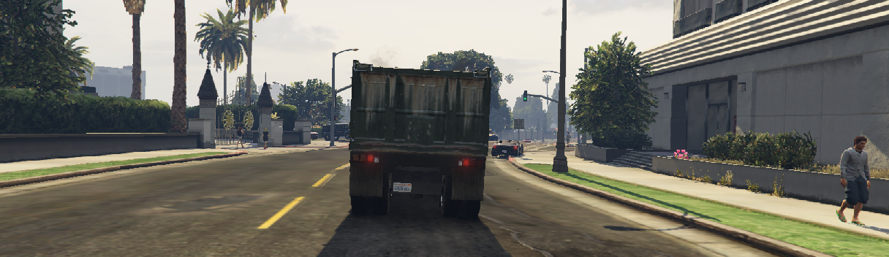
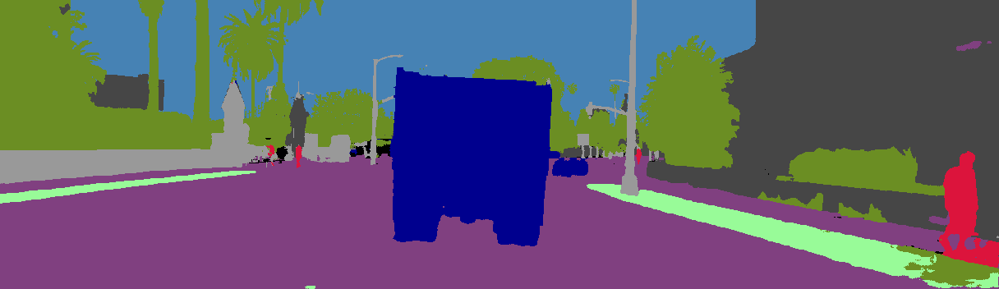
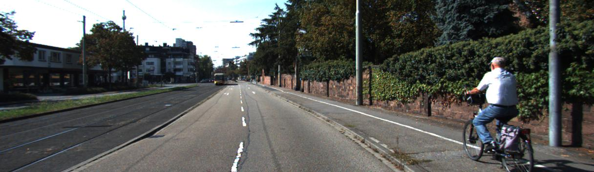
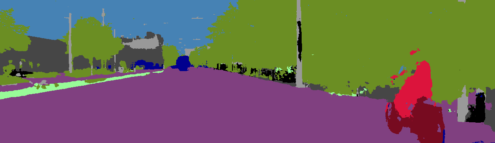
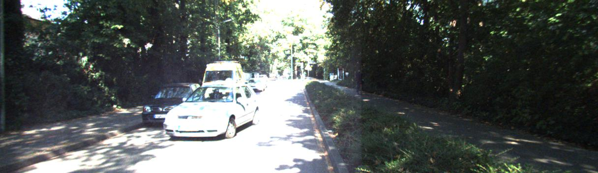
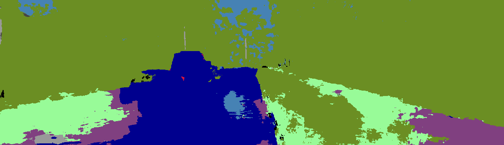
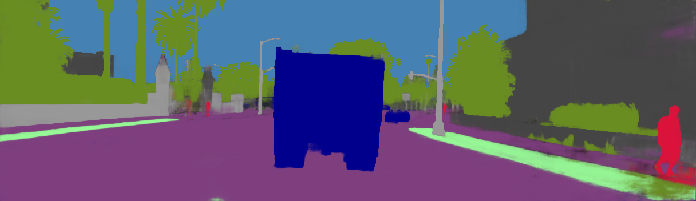
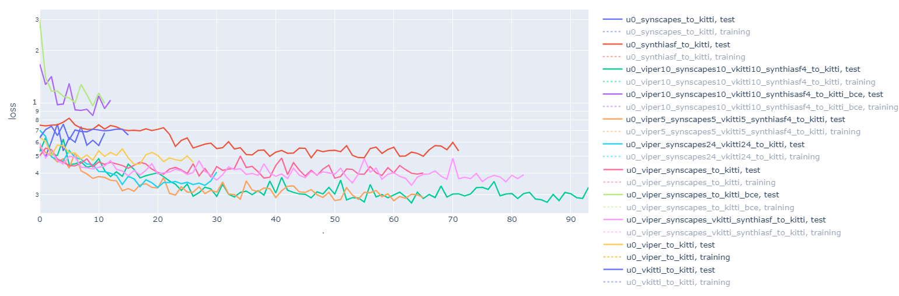
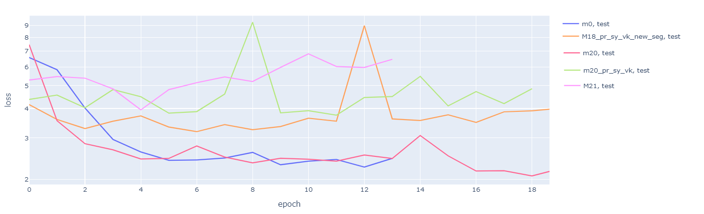

# Report 13

## Solution 13.1: An issue in semantic segmentation \[-&gt; issue 12.1\]

I have an issue that my trained sem-seg networks weren't able to predict anything on different datasets. It was my mistake in using a wrong program to read images an feed them to the networks. Now the sem-seg networks can detect semantic segmentation on all datasets. 

One of the networks was trained on Viper dataset and synscapes dataset. Some examples of its predictions are as follows:

## Issue 13.1: Clipped signals

As you can see in Figure 13.5, some signals are clipped due to the saturation of the camera sensor. You can't distinguish between the different colors of a car, some parts of the street, sky, and some leaves. It probably troubles sem-seg networks in prediction.

## Issue 13.2: How to use sem-segs ?

Two different way is possible to use sem-segs in feeding depth estimation networks. The output of sem-seg networks has several layers, each relates to a specific class of objects and it contains the probability of existence of that object. It means that output may have several layers. Because some of the datasets \(e.g. PreSIL\) don't have sem-seg labels, for those depth estimator networks that use both raw image and sem-seg data, sem-seg labels should be generated. This generation of sem-seg labels \(in fact predicting labels\) takes lots of time during training. A practical approach is to use offline predictions that are saved on computer storage \(in image formats\). This leads to an issue: probabilities will be wiped out because I should use argmax to decrease matrix layers to 3\(and encode one-hot labels to sparse labels\).

## Result 13.1: Best Combination for Sem-Seg on KITTI

Following Figure 13.8 shows no dataset singly can train the network to gain the best result. A combination of all synthetic datasets \(or two\) is the optimum solution.

## Result 13.2: Final Experiment

The final experiment is training a network on synthetic image and sem-seg and testing it on a non-synthetic dataset. From Figure 13.9 three conclusions can be driven:

1. M18 is more capable in domain adaptation and generalization than M21\(M18 uses image edges instead of a raw image\)
2. M18 is more capable in domain adaptation and generalization than M20\(green in the image\), i.e **semantic segmentation improves the results**.
3. M0 and M20\(red\) performed better that M18, M20\(green\) and M21, i.e. there is a domain shift which decreas the performance of networks trained on a different dataset than the test dataset.

### What is domain shift?

Domain shift is the risk associated with domain adaptation. \[1\] says:

> We consider the problem of unsupervised domain adaptation in semantic segmentation. **The key in this campaign consists in reducing the** _**domain shift**_**, i.e., enforcing the data distributions of the two domains to be similar.**

### What are the elements cause domain shift between these datesets?

1. Differences in **visual features** like spacial geometries and textures. E.g lot of differences exist between urban scenes in Europe, North America, the middle east and Africa.
2. Differences in **lighting**: Differences in whether condition and the angle of the sun's rays cause a scene to seem different.
3. Differences in **camera model:** Differences in the field of view and characteristics of the camera sensor in the mapping of colors cause a scene to seem different.

### What are my reasons for the claim that a domain shift exists in this case?

Compare Figure13.1, Figure13.3 ,  and Figure13.5.

### Does this domain shift discredit synthetic datasets?

Never. This phenomenon also exists between non-synthetic datasets\(as I showed in my first experiment\)

## Next Step\(also final steps\)

* Training networks on synthetic depth labels with less than 80 meter maximum depth.  Current synthetic depth labels have a maximum depth of 3000 meter,  whereas non-synthetic KITTI dataset has a maximum depht of 80 meter.
* Using sem-segs generated by networks trained on synthetic datasets along with KITTI dataset to train an M21 or M18. In this case both domain adaptation and using sem-seg for estimating depth will be examined.
* Lyft dataset \(maybe less domain shift happens\)

## References

\[1\]Y. Luo, L. Zheng, T. Guan, J. Yu, and Y. Yang, “Taking A Closer Look at Domain Shift: Category-level Adversaries for Semantics Consistent Domain Adaptation,” arXiv:1809.09478 \[cs\], Apr. 2019, Accessed: May 03, 2020. \[Online\]. Available: [http://arxiv.org/abs/1809.09478](http://arxiv.org/abs/1809.09478).

