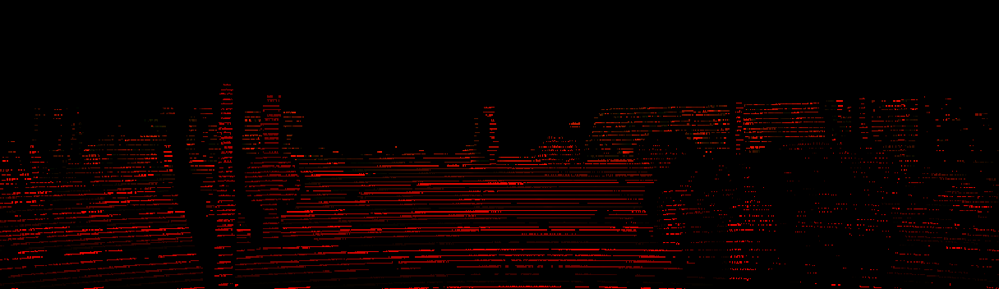

# Report 14

## Result 14.1:

**Experiment:** Using sem-segs generated by networks trained on synthetic datasets along with KITTI dataset to train an M21 or M18. In this case both domain adaptation and using sem-seg for estimating depth will be examined.

**Result:** In the following image, the purple graph is the baseline and shows the performance of a simple FCRN network after training on KITTI. The cyan graph is the performance of an M18 network that is trained on KITTI images and generated semantic segmentations. **Therefore the performance is degraded.**

## **Result 14.2:**

**Experiment:** performance comparison of two networks, one trained on a non-synthetic dataset \(lyft 5\) and one on a synthetic dataset \(Virtual kitti 2\).

**Result:** **The performance of the network that is trained on the non-synthetic dataset is better\(red graph relative to green graph\).** Comparison is based on the KITTI depth benchmark, i.e. both networks are evaluated on the validation set of the KITTI depth estimation subset. IN the following image purple, green, and red correspond to training on KITTI, Virtual KITTI, and Lyft 5 respectively.

## **Result 14.3:**

**Experiment**: Training networks on synthetic depth labels with less than 80 meters maximum depth. Current synthetic depth labels have a maximum depth of 3000 meters, whereas the non-synthetic KITTI dataset has a maximum depth of 80 meters.

**Resut**: Not done yet

##  Discussion 14.1:

Result comparison:

Datasets Comparison:

Depth distribution: depth histogram of previos depth maps is as follows:

